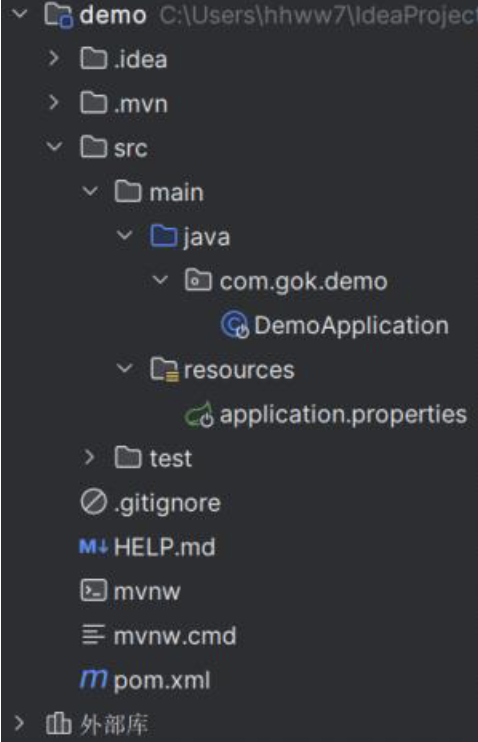
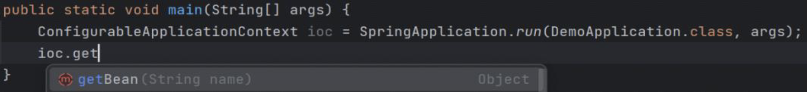

# Spring Boot介绍

## Spring Boot 项目结构



 >[!INFO] 
>  * **src/main/java**: 存放 `.java` 文件。
> 	 *  **DemoApplication**: 项目默认启动类。
>  * **src/main/resources**: 存放配置和资源文件。
> 	*  application.properties**: 项目配置文件。
 > * **src/test/java**: 存放测试 `.java` 文件。
 > * **.mvn/mvnw/mvnw.cmd**: Maven 的工具，IDEA 已经内置可以直接删除。
 > * **pom.xml**: Maven 用于管理整个项目的文件。

## 默认启动类

```java
@SpringBootApplication
public class DemoApplication {
    public static void main(String[] args) {
        SpringApplication.run(DemoApplication.class, args);
    }
}
```
### 问题
#####  `ioc` 怎么不见了？


  - 🌟`run` 方法的返回值就是 `ioc` 容器。
##### 不是和基于配置类（Spring 3.0）写法一样吗？配置类在哪里？
   * `@SpringBootApplication` 内部包含 `@Configuration`，所以默认启动类也是配置类。在 `run` 方法里，默认启动类（`DemoApplication`）作为参数，构造生成 `ioc`。
##### `@ComponentScan` 在哪里？
  - `@SpringBootApplication` 内部包含 `@ComponentScan`。
  -  🌟Spring Boot 项目默认扫码包就是默认启动类（`DemoApplication`）所在的包。
##### `pom.xml` 文件示例

```xml
<parent>
    <!-- Spring Boot 父工程，管理所有 Spring 依赖的版本 -->
    <groupId>org.springframework.boot</groupId>
    <artifactId>spring-boot-starter-parent</artifactId>
    <version>3.2.3</version>
</parent>

<!-- Spring 应用所需的 jar 包 -->
<dependency>
    <groupId>org.springframework.boot</groupId>
    <artifactId>spring-boot-starter</artifactId>
</dependency>

<!-- Spring 单元测试 -->
<dependency>
    <groupId>org.springframework.boot</groupId>
    <artifactId>spring-boot-starter-test</artifactId>
    <scope>test</scope>
</dependency>

<build>
    <plugins>
        <!-- 用于构建 Spring Boot 项目的 Maven 插件 -->
        <plugin>
            <groupId>org.springframework.boot</groupId>
            <artifactId>spring-boot-maven-plugin</artifactId>
        </plugin>
    </plugins>
</build>
```
