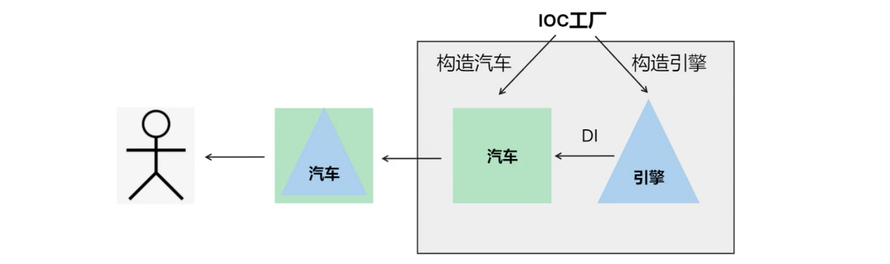

# 深入IOC [Bean](../概念/Bean.md)


## IOC容器创建方式
1. 通过 XML 配置
	- 使用 `ClassPathXmlApplicationContext`。
2. 通过配置类
	- 使用 `@Configuration` 注解。
	- `AnnotationConfigApplicationContext`。
3. Spring Boot 方式
	* 使用 `ConfigurableApplicationContext`。

🌟 不同类型的容器使用不同的初始化方式[Bean](../概念/Bean.md)
## Bean
### 概念
* Bean 是被 Spring IOC 管理的对象。
### 创建方式
  * 通过 XML 配置 `<bean>` 标签。
  * 使用 `@Component` 注解。
### 创建过程
1. IOC读取`<bean>`标签或@Component
2. 容器创建 Bean 对象，并放到自身中进行管理（控制反转）。
3. 设置 Bean 对象间的依赖关系（依赖注入）。


🌟 控制反转：对象创建权力被反转。
🌟 依赖注入：将一个对象放入另一个对象。
### 注解详解
- **`@Component`**: 表示要被 IOC 管理<span style="background:#fff88f">（放在类上）</span>。类名开头变成小写是 Bean 的 name。
- 衍生注解（本质上也是 `@Component`）：
	- `@Configuration`: 配置类，代替 XML 配置文件。
	- `@Service`: 表示服务层。
	- `@Repository`: 表示持久层。
## `@Bean` 注解
功能和 `@Component` 一样，表示要被 IOC 管理，但使用方式不同。
### 使用方式
1. 在 `@Configuration` 配置类中使用。
2. @Bean要放在<span style="background:#fff88f">方法上（方法名就是bean的name）</span>
```java
@Configuration
public class Config {
	@Bean
	public IEngine engine3() {
		return new Engine3();
	}
}
```

### 解决@Component的不足
@Component必须写在类上，如果是第三方包我们<span style="background:#fff88f">无法在类上添加该注解，无法自定义初始化过程</span>
#### 示例场景：创建一个初始值为 {1, 2, 3} 的 `ArrayList`
```java
@Configuration
public class Config1 {
    @Bean
    public List<Integer> numbers() {
        List<Integer> res = new ArrayList<>();
        res.add(1);
        res.add(2);
        res.add(3);
        return res;
    }
}
```
####  练习：将生产一批汽车从 `@Component` 全部改为 `@Bean`
```java
@Configuration
public class Config {
    @Bean
    public IEngine engine() {
        return new Engine1();
    }

    @Bean
    public Car car(IEngine engine) {
        return new Car(engine);
    }
}
```
##### 问题
1. 直接调用 `engine()` 得到的对象和 IOC 管理的 `engine` 对象是什么关系？
2. 如果多调用几次 `engine()`，它们返回的对象是同一个吗？
	* 🌟<span style="background:#fff88f"> 在 `@Configuration` 下的 `@Bean` 方法</span>，返回对象就是 IOC 所管理的对象，默认情况下多次调用方法都<span style="background:#fff88f">返回同一对象。</span>
##### 练习简写：参数自动装配
```java
//Config.java
@Configuration  
public class Config {  
    @Bean  
    public IEngine engineA() {  
        return new EngineA();  
    }  
    @Bean  
    public IEngine engineB() {  
        return new EngineB();  
    }  
}
```
```java
//Config1.java
@Configuration  
public class Config1 {  
    @Bean  
    public Car car(@Qualifier("engineB") IEngine engine) {  
        return new Car(engine);  
    }  
}
```
```java
//EngineA.java
public class EngineA implements IEngine{  
    @Override  
    public String toString() {  
        return "EngineA{}";  
    }  
}
```
```java
//EngineB.java
public class EngineB implements IEngine{  
    @Override  
    public String toString() {  
        return "EngineB{}";  
    }  
}
```
```java
//Section18SpringBootApplication.java
@SpringBootApplication  
public class Section18SpringBootApplication {  
  
    public static void main(String[] args) {  
        //ConfigurableApplicationContext ioc = SpringApplication.run(Section18SpringBootApplication.class);  
  
        AnnotationConfigApplicationContext ioc = new AnnotationConfigApplicationContext(Config.class, Config1.class);  
  
        Car car = ioc.getBean(Car.class);  
        car.showEngine();  
  
        EngineB iEngine = ioc.getBean(EngineB.class);  
        System.out.println(iEngine);  
    }  
}
```
#### 注意事项
- 只有被 IOC 管理的对象才能参数自动装配。
- 参数装配与 Bean 的声明顺序无关，Spring 会解析依赖关系，自己控制顺序。
- 扩展
	- 在同一配置类中顺序无所谓。
	- 在不同配置类中顺序也无所谓。
##### `AnnotationConfigApplicationContext()`和`SpringApplication.run()`两种IOC配置方式的的区别
```java
ConfigurableApplicationContext ioc = SpringApplication.run(Section18SpringBootApplication.class);  
  
AnnotationConfigApplicationContext ioc = new AnnotationConfigApplicationContext(Config.class, Config1.class);
```
## `@Import` 注解
表示要被 IOC 管理。
###  使用方式
```java
//Config.java
@Configuration  
@Import({Car.class, EngineA.class, EngineB.class})  
public class Config {  }
```
```java
//Car.java
public class Car {  
    @Autowired  
    @Qualifier("engineA")  
    private IEngine iEngine;  
    public void showEngine() {  
        System.out.println(iEngine);  
    }  
}
```

### 构造 Bean 调用哪个构造方法？
#### **`@Component` / `@Import`**
1. 有默认构造时调用默认构造。
```java
private @Qualifier("engineA") IEngine iEngine = private IEngine engineA
```
2. 只有一个有参构造时调用该有参构造并进行参数装配。
```java
@Component  
public class Car {  
	private IEngine iEngine;  
  
	public void showEngine() {  
		System.out.println(iEngine);  
	}  
  
	public Car(IEngine engineB) {  
		this.iEngine = engineB;  //按照变量名进行匹配
		System.out.println("一个参数的构造方法");  
	}  
}
```
3. 多个有参构造且没有无参构造，会报错。
#### **`@Bean`**：可以在方法中自由选择构造。
```java
@Component
public class Car {
	private IEngine iEngine;

	public void showEngine() {
		System.out.println(iEngine);
	}

	public Car(IEngine engineB) {
		this.iEngine = engineB;//Match according to the variable name
		System.out.println("一个参数的构造方法");
	}
}
```
## `@Order` 注解 / 实现 `Ordered` 接口
- 当有多个同类型的 Bean，用 `List` 接收时，通过 `@Order` 注解改变 Bean 在 `List` 中的顺序，<span style="background:#fff88f">值越小优先级越高。</span>
### Order注解
```java
// Computer.java  
@AllArgsConstructor  
public class Computer {  
    private ICpu iCpu;  
    private List<IMemory> iMemory;  
}
```
> `@AllArgsConstructor`全参构造里面不能加入注解
```java
// Config.java  
@Configuration  
public class Config {  
    @Bean  
    public ICpu cpuA() {  
        return new CpuA();  
    }  
    @Bean  
    public ICpu cpuB() {  
        return new CpuB();  
    }  
    @Bean @Order(0)  
    public IMemory memoryA() {  
        return new MemoryA();  
    }  
    @Bean @Order(1)  
    public IMemory memoryB() {  
        return new MemoryB();  
    }  
    @Bean  
    public Computer computer(ICpu cpuA, List<IMemory> memory) {  
        return new Computer(cpuA, memory);  
    }  
}
```
### 实现Ordered接口
```java
// MemoryA.java  
@Component  
public class MemoryA implements IMemory, Ordered {  
    @Override  
    public int getOrder() {  
        return 2;  
    }  
}
```
## `@Lazy` 注解
- 普通 Bean 在 IOC 加载时已经创建。
- 加上 `@Lazy` 的 Bean 只有在使用时（自动注入/getBean）才创建。
```java
// Config.java  
@Configuration  
public class Config {  
    @Bean  
    @Lazy    public ICpu cpuA() {  
        return new CpuA();  
    }  
    @Bean  
    public ICpu cpuB() {  
        return new CpuB();  
    }  
    @Bean  
    public IMemory memoryA() {  
        return new MemoryA();  
    }  
    @Bean  
    public IMemory memoryB() {  
        return new MemoryB();  
    }  
    @Bean  
    @Lazy    public Computer computer(ICpu cpuA, List<IMemory> memory) {  
        return new Computer(cpuA, memory);  
    }  
}
```
### 懒加载
- `cpuA` 和 `computer` 懒加载，默认不创建 Bean。
- 当调用 `ioc.getBean(Computer.class)` 时才会创建 `computer`；
- 又因为创建computer需要注入cpuA，所以创建cpuA执行顺序getBean -> cpuA -> computer
##### 懒加载的优势
🌟 懒加载可以提高Spring应用启动速度，项目中bean会非常多，如果都在启动时创建很耗时，使用时再创建更合理
## `@Scope` 注解
设置 Bean 的作用域，有两种类型：
- `singleton`（默认，整个应用中只使用一个对象）。
- `prototype`（每次获取 Bean 时返回一个新的对象）。
```java
//Config.java
@Configuration
public class Config {
    @Bean
    public ICpu cpuA() {
        return new CpuA();
    }

    @Bean
    public IMemory memoryA() {
        return new MemoryA();
    }

    @Bean
    public IMemory memoryB() {
        return new MemoryB();
    }

    @Bean
    @Scope(ConfigurableBeanFactory.SCOPE_PROTOTYPE)
    public Computer computer(ICpu cpuA, List<IMemory> memory) {
        return new Computer(cpuA, memory);
    }
}
```
```java

//Main.java
public static void main(String[] args) {
    ConfigurableApplicationContext ioc = SpringApplication.run(SpringTestApplication.class, args);
    Computer com1 = ioc.getBean(Computer.class);
    Computer com2 = ioc.getBean(Computer.class);
}
```
- **单例**：更加节省内存。
- **多例**：如每辆汽车都要一个发动机，这时发动机就不能单例。
---