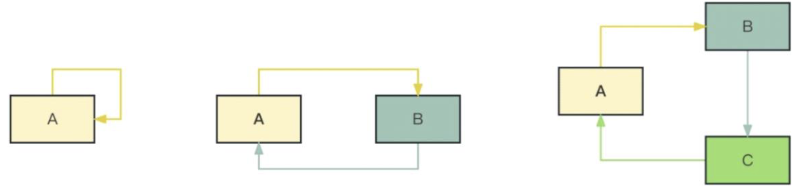
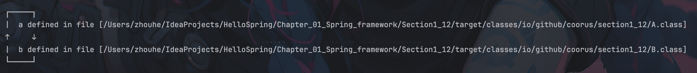
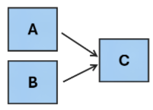

# Bean 对象的创建与循环依赖


## 一、创建 Bean 与依赖注入

在 Spring 框架中，Bean 对象的创建大致分为两步：
1. 创建 Bean
2. 依赖注入


#### 示例场景
创建完成 A 后，发现 A 需要注入 B，转而创建 B，B 又需要 A，转而创建 A……如此进入了一个死循环。Spring Boot 默认情况下会报错，但也提供了解决方案来处理此类循环依赖。
```java
// A.java
@Component
public class A {
    private B b;
    public A(B b) {
        this.b = b;
    }
}
```
```java
// B.java
@Component
public class B {
    private A a;
    public B(A a) {
        this.a = a;
    }
}
```

#### 练习
* 练习 1：使用 `@Component` + `@Resource` 实现循环依赖
* 练习 2：使用 `@Bean` 实现循环依赖


## 二、循环依赖的解决方案
循环依赖时，**在各自类中使用循环依赖项则会报错**，解决方案如下：
### 通过配置来全局允许循环依赖
```properties
# application.properties
spring.main.allow-circular-references=true
```

> **注意：** 此配置只适用于 `@Component` + `@Resource` 组合。

### 修改类的关系，避免循环依赖
从代码设计的层面，通过**引入中间类**等方式，修改类的依赖关系，避免循环依赖的产生。



### 使用 `@Lazy` 注解

`@Lazy` 注解可将 Bean 的实例化推迟到 IOC 容器加载之后进行，从而避开循环依赖问题。
#### @Componet写法
```java
// A.java
@Component
public class A {
    private B b;
    // 只代表注入的时候是懒加载
    public A(@Lazy B b) {
        this.b = b;
    }
}

```
```java
// B.java
@Component
public class B {
    private A a;
    public B(@Lazy A a) {
        this.a = a;
    }
}
```
#### @Bean写法

```java
// Config.java  
@Configuration  
public class Config {  
    @Bean  
    public A a(@Lazy B b) {  
        return new A(b);  
    }  
    @Bean  
    public B b(@Lazy A a) {  
        return new B(a);  
    }  
}
```

```java
// A.java  
public class A {  
    private B b;  
  
    public A(B b) {  
        this.b = b;  
    }  
}
```

```java
// B.java  
@Component  
public class B {  
    //@Resource  
    private A a;  
  
    public B(A a) {  
        this.a = a;  
    }  
}
```
