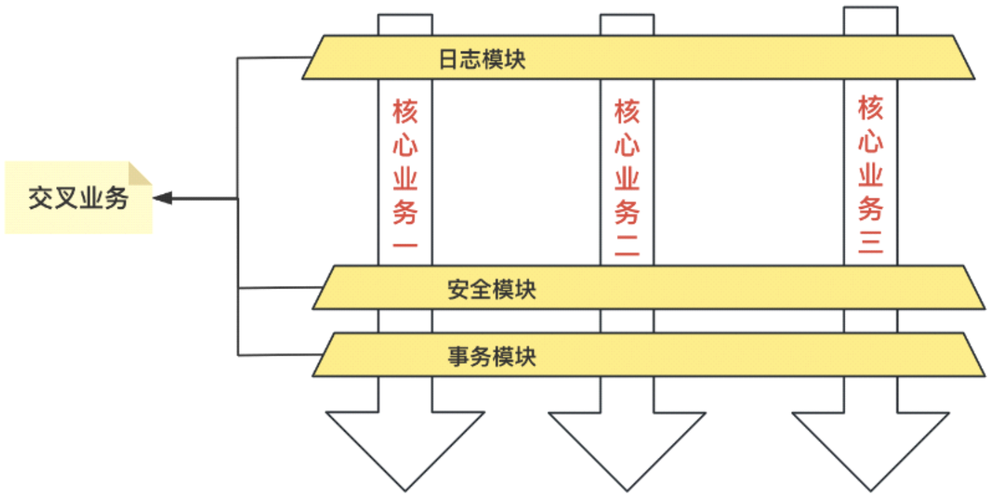

# AOP介绍


## 一、AOP 的概念

AOP（Aspect-Oriented Programming，面向切面编程）是一种编程范式，旨在通过将横切关注点与核心业务逻辑分离来提高代码的模块化和可维护性。AOP 提供了一种动态插入代码逻辑的方式，允许开发人员在不修改原始代码的情况下，添加特定功能（如日志记录、事务管理等）。

在 AOP 中，**横切关注点**（cross-cutting concerns）指那些通常分散在多个模块中的行为，比如日志、异常处理、权限检查等。这些功能并不是业务的核心部分，但又在整个应用中多次出现。AOP 通过 **切面**（Aspect）的概念，将这些行为统一管理。

主要的 AOP 术语包括：

- **切面（Aspect）**：用于封装横切关注点的模块。
- **连接点（Join Point）**：程序执行的某个点，比如方法调用、异常抛出等。
- **通知（Advice）**：在特定的连接点上执行的代码逻辑。
- **切入点（Pointcut）**：定义通知执行的规则或位置。
- **目标对象（Target Object）**：被代理、被通知的对象。
- **织入（Weaving）**：将切面逻辑应用到目标对象的过程。


* 🐸🐸 **优势：不用改变原有代码，在原有代码上增加功能**
### 图解

java原有代码使用OOP思想编写，好比火锅套餐AOP思想就像味碟，每个人根据自己口味添加，又不影响整个火锅的味道。
所以主要使用在与业务无关的公共代码
### 示例：简单的 AOP 配置

以下是使用 Spring AOP 实现的[日志记录切面示例](../概念/日志记录切面示例.md)：

```java
@Aspect
@Component
public class LoggingAspect {

    @Before("execution(* com.example.service.*.*(..))")
    public void logBefore(JoinPoint joinPoint) {
        System.out.println("Executing method: " + joinPoint.getSignature().getName());
    }
}
```

在这个示例中，`logBefore` 方法会在 `com.example.service` 包中的所有方法执行之前被调用，实现了日志记录功能 📝。

## 二、AOP 的历史

AOP 的思想可以追溯到 1990 年代中期。当时，软件开发者发现横切关注点（例如日志记录、权限控制等）在程序的多个地方都需要处理，而这些代码往往会使核心业务逻辑复杂化。

AOP 的最初概念来自 **Gregor Kiczales** 等人的研究工作，他们于 1997 年在论文《Aspect-Oriented Programming》中正式提出了这个编程范式。此后，Java 世界中最知名的 AOP 框架 **AspectJ** 诞生，并成为 AOP 实现的典范。随着时间的发展，Spring 框架也引入了 AOP 支持，使得 AOP 成为企业级应用开发中的重要工具。

## 三、AOP 的应用场景

AOP 在软件开发中有着广泛的应用，特别是在处理那些需要在多个地方重复执行的横切关注点时，AOP 的优势尤为明显：

### 1. **日志记录**
通过 AOP，可以在方法执行的前后添加日志记录逻辑，而无需在每个方法中手动编写日志代码。这使得日志逻辑与业务逻辑分离，代码更加简洁 📝。

### 2. **事务管理**
在企业级应用中，事务的管理是非常常见的需求。通过 AOP，可以在特定方法执行时自动管理事务，如在方法开始时开启事务，方法结束时提交事务，发生异常时回滚事务。

#### 示例：事务管理切面

```java
@Aspect
@Component
public class TransactionAspect {

    @Around("execution(* com.example.service.*.*(..))")
    public Object manageTransaction(ProceedingJoinPoint joinPoint) throws Throwable {
        // 开启事务
        System.out.println("Transaction start");
        Object result = joinPoint.proceed();
        // 提交事务
        System.out.println("Transaction commit");
        return result;
    }
}
```

在该示例中，方法执行前后会自动处理事务⏳。

### 3. **权限验证**
AOP 可以用于验证用户是否有权限访问某些功能。在进入业务方法前，AOP 切面可以检查用户的权限，确保只有具备适当权限的用户才能继续操作 🔐。

### 4. **异常处理**
AOP 可以集中处理程序中的异常逻辑。例如，通过 AOP，在方法执行过程中捕获并处理异常，从而减少代码中的重复性。

### 5. **性能监控**
通过 AOP，可以轻松地为应用添加性能监控，记录方法执行时间，帮助优化应用性能⏱️。

## 四、AOP 的优势

1. **代码复用性高**：横切关注点的代码可以集中在切面中，不再散落于各处，减少了代码的重复性。
2. **代码可维护性好**：业务逻辑与横切关注点分离，使得代码的修改和维护更加便捷。
3. **减少代码耦合**：通过 AOP，可以将横切关注点与核心业务代码解耦，从而提高代码的可测试性和可维护性。

---

## 总结

AOP 是一种强大的编程范式，旨在通过分离横切关注点来提高代码的模块化和可维护性。无论是日志记录、事务管理还是权限验证，AOP 都能帮助开发人员在不影响核心业务逻辑的情况下，灵活地添加这些额外功能。随着框架（如 Spring）的广泛应用，AOP 已成为现代 Java 开发中必不可少的一部分。通过合理使用 AOP，我们可以使代码更加简洁、可维护性更强，同时减少冗余代码的产生。